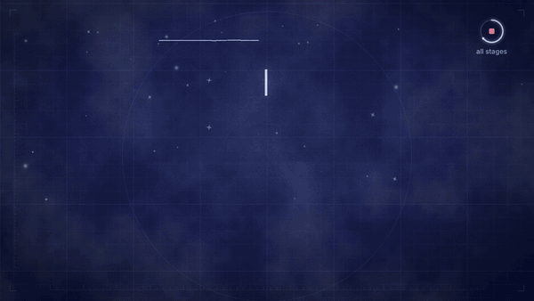

# inked-explainer

A [Claude Code](https://claude.ai/code) skill for making **hand-inked explainer videos entirely in code** — warm printed paper with pastel diagonal stripes alternating with a navy blueprint, drawn props that carry the story, lowercase titles typed in top-left, a progress dial top-right, ink wobble and film grain, and a soundtrack (music bed + sound effects) synthesised from nothing. In the style of the hand-drawn explainer animations going around in 2026.



▶ [Watch the demo with sound](media/preview.mp4) — 17.6 s, rendered from the template in this repo.

## Install

```bash
npx skills add mateo-khalil/inked-explainer
```

Then ask Claude Code for a video: *"make a 40-second explainer for our app in the inked style"*, *"turn this feature list into a hand-drawn promo"*, *"make a vertical cut for Reels"*.

## What's inside

```
skills/inked-explainer/
  SKILL.md                         the workflow and the hard rules
  references/
    style-guide.md                 grounds, ink, palette, type, stickers, props, grain
    motion-and-timing.md           the bar grid, the beat shape, easing, camera, aiming a prop
    sound-design.md                the synthesised bed, the SFX vocabulary, mix + loudness
    scene-recipes.md               props that hit their mark, hold rings, counters, receipts, stamps,
                                   radar sweeps, matrices, stars, orbits, end cards
    vertical-and-store-cuts.md     portrait re-composition, crops, App Store preview specs
    qa-checklist.md                stills, contact sheets, cuts, loudness, render traps
  template/                        a working Remotion 4 project — copy it to start a film
```

## Quick start (without Claude)

```bash
cp -R skills/inked-explainer/template my-film && cd my-film
npm install
npm run assets          # generates textures, the music bed and every sound effect
npm run studio          # scrub it
npm run render          # out/film.mp4           1920×1080 @ 60
npm run render:vertical # out/film-vertical.mp4  1080×1920 @ 60
```

Needs Node 18+ and ffmpeg (Remotion bundles its own). `npm run assets` has **zero dependencies** — the paper, blueprint and grain textures come from seeded noise and a tiny PNG encoder; the music and effects from oscillators, noise and a small reverb. Generated files (`public/tex`, `public/music-*.wav`, `public/sfx`) are gitignored.

## How the style works, in one screen

- **Time is a grid.** 60 fps on a BPM (150 → a bar is 96 frames). Every chapter is a whole number of bars, so every hard cut lands on a bar line — and the music is generated *from the same timeline file*, so it changes exactly where the picture cuts.
- **Two grounds, alternating.** Paper chapters (stripes, a multiplied paper texture, ink outlines, pencil construction marks) show what something *feels* like; blueprint chapters (grid, rulers, glowing lines, mono chips) show how it *works*.
- **Everything is a function of the frame.** Each chapter is a React component drawing SVG for `useCurrentFrame()`. A low-frequency displacement filter re-seeded at 8 fps gives every line a hand-drawn wobble; text stays crisp on a separate layer.
- **A beat shape per chapter**: establish (0–40) · one focal action (40–130) · payoff (130–170) · lean into the cut.
- **Stickers** carry the product's own art into the paper world: any picture or vector drawing gets a die-cut white border, an ink line and a shadow (a glow on the blueprint).
- **Props, not a mascot**, carry the story — a pencil that taps and draws, a metronome on the beat, a nib that inks — each posed as a function of the frame. Bring your own character if you have one; the template ships none.
- **Sound**: marimba on paper chapters, bells on blueprint ones, a pad, a light kit, an air swell into every cut, and a vocabulary of synthesised effects placed by each scene in its own frames.
- **One scene file, two orientations.** Scenes derive their layout from the frame size, so the same film renders 16:9 and 9:16.

## Origin

Extracted from a promo film made for a production app: three films (16:9, a vertical social cut and an App Store preview cut) drawn and scored in code, then generalised into this template: the style only, with a demo of its own and no characters.

## License

MIT
